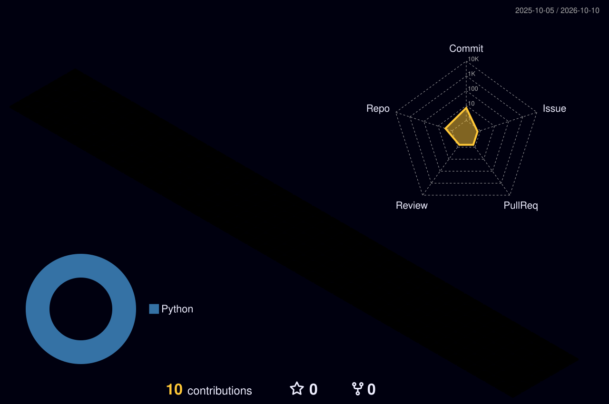

<div align="center">



<br>

<a href="https://github.com/sakib-18">

</a>
<a href="www.linkedin.com/in/fatin18">

</a>
<a href="mailto:fatinsakib786@gmail.com">

</a>

<br><br>


</div>

---

## ✦ About Me

> ### I don't just learn technology — I build with it.

I'm **Fatin Israk Sakib**, a Computer Science & Engineering student interested in **software development, artificial intelligence, machine learning, and computer vision**.

I enjoy turning concepts into practical projects, experimenting with different approaches, and improving through hands-on development. My current focus is building a strong foundation in programming and software engineering while exploring how AI can be applied to real-world problems.

### What drives me

```text
        LEARN
          ↓
      EXPERIMENT
          ↓
        BUILD
          ↓
        TEST
          ↓
       IMPROVE
          ↓
        REPEAT
```

- 🧠 Learning through implementation
- 🤖 Exploring AI, Machine Learning & Computer Vision
- 💻 Building practical software projects
- 🔬 Interested in research-oriented development
- 🧩 Strengthening programming and problem-solving skills
- 🚀 Working toward becoming a well-rounded software engineer

---

## ⚡ Tech Arsenal

<div align="center">

### Languages


### AI / Machine Learning


### Tools & Development


</div>

---

## 🚀 Featured Work

<table>
<tr>
<td width="50%" valign="top">

### 🔢 Base Conversion

A C-based number conversion application with an organized command-line interface and file handling.

**Highlights**
- Binary, Decimal, Octal & Hexadecimal
- Input validation
- File handling
- Conversion records
- Clean CLI workflow

**Stack:** `C` `File Handling`

<a href="https://github.com/sakib-18/Base-Conversion">

</a>

</td>

<td width="50%" valign="top">

### 🩺 Medical Image Classification

Deep-learning research work focused on gastrointestinal endoscopic image classification.

**Architectures explored**
- EfficientNetV2B3
- ResNet50
- DenseNet121
- MobileNetV2
- InceptionV3

**Stack:** `Python` `TensorFlow` `Keras` `CNN`


</td>
</tr>
</table>

---

## 🧠 Current Focus

| Area | Focus |
|:---|:---|
| 🤖 Artificial Intelligence | Machine Learning & Deep Learning |
| 👁️ Computer Vision | Image Classification & CNNs |
| 💻 Software Development | Practical applications & clean code |
| 🧮 Algorithms | Problem solving & optimization |
| 🗄️ Databases | SQL & data management |
| 🐧 Systems | Linux & operating-system fundamentals |

---

## 📊 GitHub Analytics

<div align="center">


</div>

<br>

<div align="center">


</div>

---

## 🧊 3D Contribution View

<div align="center">



</div>

---

## 🐍 Contribution Journey

<div align="center">

<picture>
<source media="(prefers-color-scheme: dark)" srcset="https://raw.githubusercontent.com/sakib-18/sakib-18/output/github-contribution-grid-snake-dark.svg">
<source media="(prefers-color-scheme: light)" srcset="https://raw.githubusercontent.com/sakib-18/sakib-18/output/github-contribution-grid-snake.svg">

</picture>

</div>

---

## 🌌 Development Philosophy

<div align="center">

**LEARN** → **BUILD** → **EXPERIMENT** → **IMPROVE**

<br><br>

<i>Learn deeply. Build consistently. Improve continuously.</i>

</div>

---

## 🎯 2026 Goals

- [ ] Build more real-world software projects
- [ ] Strengthen Data Structures & Algorithms
- [ ] Deepen Machine Learning knowledge
- [ ] Explore advanced Computer Vision
- [ ] Contribute to open-source projects
- [ ] Build a strong professional developer portfolio

---

## 🤝 Let's Connect

<div align="center">

<a href="https://github.com/sakib-18">

</a>
<a href="YOUR_LINKEDIN_URL">

</a>
<a href="mailto:YOUR_EMAIL">

</a>

<br><br>


</div>
